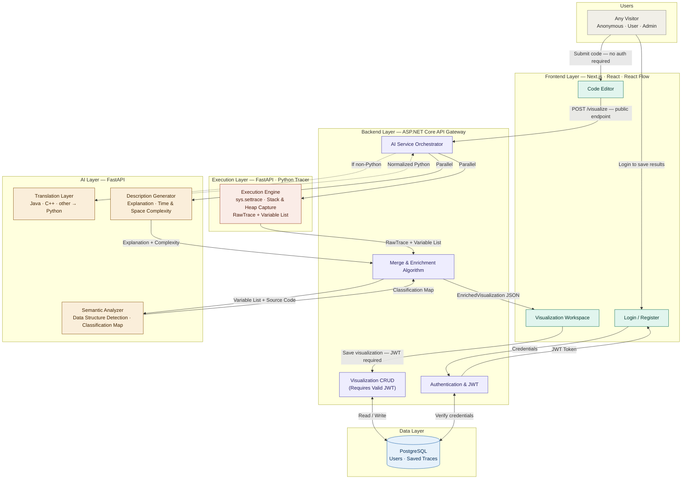

# Fahimny DSA – Algorithm & Data Structure Visualization Platform

**Domain:** EdTech, Algorithm Visualization, Dynamic Program Analysis, Artificial Intelligence

## Overview

Fahimny DSA is an AI-powered educational platform that helps students and developers understand Data Structures and Algorithms through interactive, step-by-step visualizations generated directly from their own code.

Users can write code in multiple programming languages, execute it, visualize its behavior line by line, inspect memory states, and explore high-level data structure representations generated through AI-assisted semantic analysis.

The platform bridges the gap between source code and algorithm comprehension by transforming low-level execution traces into meaningful educational visualizations.

---

## Demo

https://github.com/user-attachments/assets/0fa439bb-b391-43ec-8744-12b70278266d

---

## Key Features

### Multi-Language Support

Write code in different programming languages such as:

* Python
* C++
* Java
* Any Language

The platform uses AI-powered translation to convert non-Python code into a normalized Python representation for analysis and visualization.

### Interactive Algorithm Visualization

Execute code and navigate through execution states step-by-step.

* Play / Pause execution
* Forward and Backward navigation
* Line-by-line execution tracking
* Real-time visualization updates

### Heap Visualization

Inspect the actual runtime memory state.

* Variables
* Objects
* References
* Stack Frames
* Heap Objects

This view provides a low-level representation of program execution similar to a debugger.

### Semantic Data Structure Visualization

The platform automatically identifies and visualizes high-level data structures such as:

* Arrays
* Linked Lists
* Stacks
* Queues
* Binary Trees
* Graphs

Instead of manually interpreting memory references, users can directly observe meaningful DSA representations.

### AI-Powered Code Understanding

The AI service provides:

* Algorithm descriptions
* Time complexity analysis
* Space complexity analysis
* Data structure identification
* Semantic enrichment of execution traces

### Visualization Library

Administrators can publish predefined visualizations for commonly used algorithms and data structures.

Users can explore these examples without writing code and use them as learning resources.

### Saved Visualizations

Authenticated users can save visualizations to their personal workspace and revisit them later.

Saved visualizations include:

* Source code
* Execution traces
* Generated descriptions
* Semantic visualizations

---

# System Architecture

The platform follows a distributed microservices architecture.



## Frontend (Next.js + React Flow)

The frontend provides:

* Interactive workspace
* Visualization canvas
* Execution playback controls
* User dashboard
* Saved visualizations management

React Flow is used to render animated graph-based visualizations of algorithms and data structures.

---

## API Gateway (.NET / ASP.NET Core)

The Gateway acts as the central orchestration layer.

Responsibilities include:

* Authentication and authorization
* User management
* Saved visualization management
* Service orchestration
* Semantic enrichment
* Response aggregation

The Gateway combines outputs from multiple services into a single visualization payload consumed by the frontend.

---

## AI Service (Python FastAPI)

The AI Service provides semantic understanding of source code.

### Translation Agent

Converts non-Python source code into Python while preserving algorithmic behavior.

### Description Generator

Generates:

* Algorithm explanations
* Time complexity analysis
* Space complexity analysis

### Semantic Analyzer

Analyzes source code and identifies the intended data structures used by the programmer.

The service produces a semantic mapping used to enrich runtime traces.

---

## Execution Engine (Python FastAPI)

The Execution Engine performs deterministic code tracing using:

```python
sys.settrace()
```

The tracer captures:

* Execution steps
* Variable states
* Object relationships
* Stack frames
* Heap memory

The engine remains intentionally unaware of algorithm semantics to preserve performance and execution accuracy.

---

## Database (PostgreSQL)

Persistent storage for:

* Users
* Roles
* Authentication data
* Saved visualizations
* Public visualization library

---

# The Semantic Gap Problem

Traditional execution tracing accurately captures memory state but lacks semantic understanding.

For example:

### Built-in Ambiguity

A Python list may represent:

* Array
* Stack
* Queue
* Heap

Yet all appear identical in memory.

### Dictionary Ambiguity

A dictionary may represent:

* Hash Map
* Graph Adjacency List

### Custom Class Ambiguity

A class such as:

```python
class Node:
```

may form:

* Linked List
* Binary Tree
* Graph
* Trie

Without additional context, a tracer cannot distinguish between these structures.

This challenge is referred to as the Semantic Gap.

---

# Our Solution: Hybrid AI Pipeline

To bridge the Semantic Gap while preserving tracing performance, Fahimny DSA employs a Hybrid AI Pipeline.

## Step 1: AI Semantic Analysis

The AI Service analyzes source code before visualization generation.

It identifies:

* Data structures
* Algorithm patterns
* Semantic intent

The result is a structured semantic mapping.

---

## Step 2: Deterministic Runtime Tracing

The Execution Engine executes the code using:

```python
sys.settrace()
```

and generates a raw execution trace.

All structures are initially labeled as:

```json
{
  "kind": "unknown"
}
```

---

## Step 3: Semantic Enrichment

The .NET Gateway merges:

* Raw execution trace
* AI semantic mapping
* Generated descriptions

This process enriches runtime data with high-level DSA meaning.

---

## Step 4: Interactive Visualization

The frontend renders specialized layouts based on the identified structure.

Examples:

* Linked Lists → Sequential Layout
* Binary Trees → Hierarchical Layout
* Graphs → Force-Directed Layout
* Arrays → Indexed Layout

This produces intuitive educational visualizations that closely match the programmer's intent.

---

# Technology Stack

### Frontend

* Next.js
* React
* React Flow
* monaco-editor/react
* TypeScript

### Backend

* ASP.NET Core
* FastAPI
* Python

### Artificial Intelligence

* Large Language Models (LLMs)
* LangChain
* LangGraph
* AST Analysis

### Database

* PostgreSQL

### Infrastructure

* Docker
* REST APIs

---

# Future Work

* AI Chatbot Assistant
* Enhanced Algorithm Recognition
* Enhanced Visualization
* Additional Programming Languages
* Collaborative Learning Features
* Advanced Educational Analytics

---

# Team

Graduation Project – Faculty of Computers and Artificial Intelligence, Helwan University

**Project Name:** Fahimny DSA

## Team Members

| Name                | Role               | GitHub                                             |
| ------------------- | ------------------ | -------------------------------------------------- |
| Anas Alamir         | Backend Developer  | [@AnasAlamir](https://github.com/AnasAlamir)       |
| Islam hany          | Backend Developer  | [@MrR0B00T](https://github.com/MrR0B00T)           |
| Khaled Karam        | Frontend Developer | [@khaledkaram510](https://github.com/khaledkaram510) |
| Osama M. Sadieq     | Frontend Developer | [@Osama005](https://github.com/Osama005)           |
| Abdelfatah Abdallah | AI Developer       | [@abdelfatah02](https://github.com/abdelfatah02)   |
| Ziad Hesham         | AI Developer       | [@zozawyy](https://github.com/zozawyy)             |

Transforming Code into Understanding.
